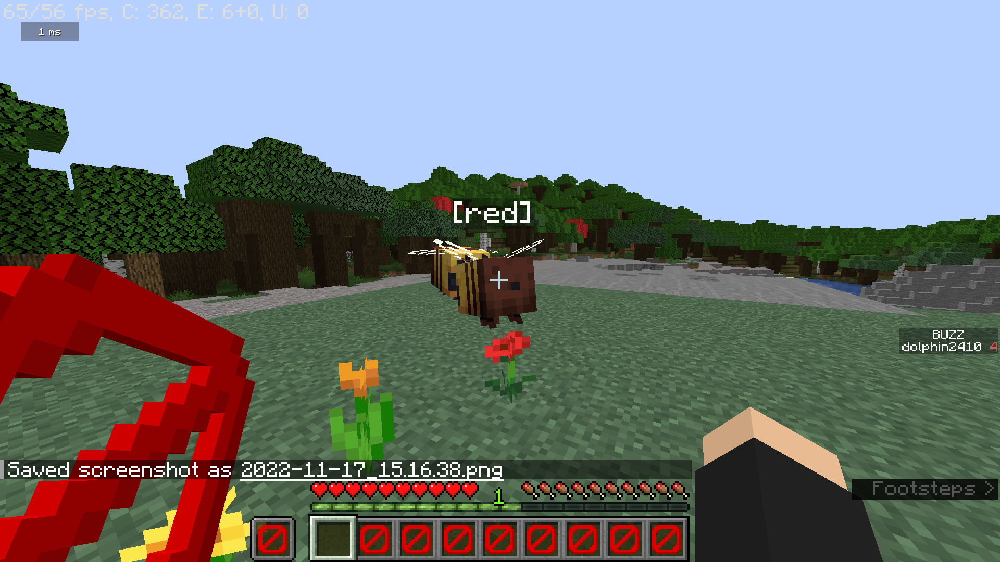
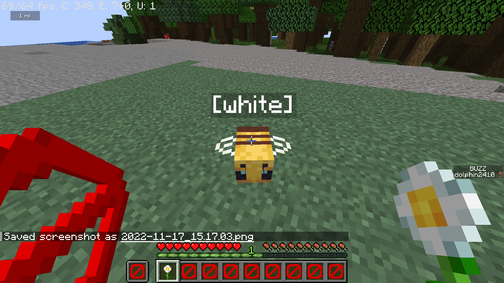
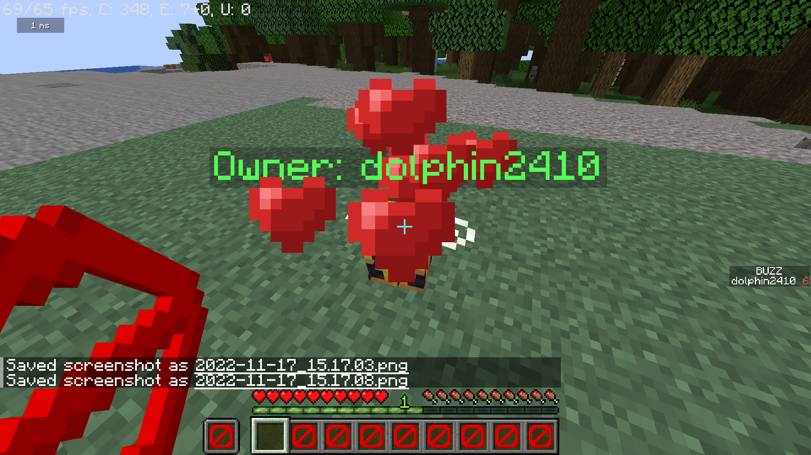
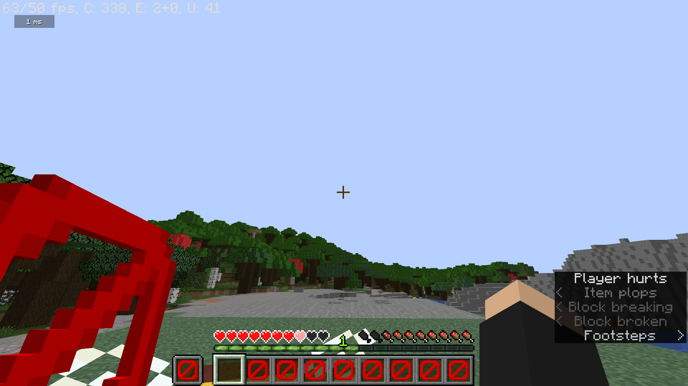
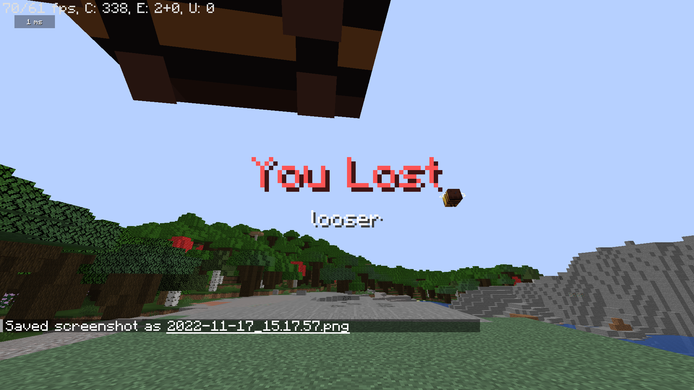

# 꿀리버

벌이 아레나에 랜덤한 색의 이름을 갖고 스폰합니다. 그 색에 맞는 꽃을 먹이면 1점을 얻고, 잘못된 꽃을 먹이면 패배하게 됩니다. 

```minecraft
아레나 설정
/buzz setarena <x1> <y1> <z1> <x2> <y2> <z2>
```

```minecraft
시작
/buzz start
```

```minecraft
종료
/buzz stop
```




